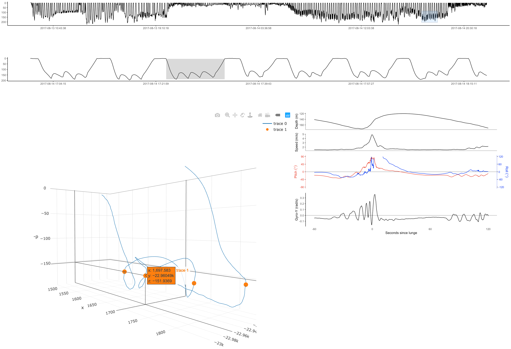

cats-viewer
================

3d visualizations of whale feeding behavior collected using CATS tags.

Installation
------------

Clone this repo using GitHub tools. The sample data is stored on figshare. From the root directory of the cats-viewer project, download the data using:

``` r
download.file("https://ndownloader.figshare.com/files/17625341", "data/bw170813-44/bw170813-44 10Hzprh.csv")
```

Usage
-----

If you're in RStudio, open server.R or ui.R and use the 'Run App' shortcut button. You can also run the app from the console using:

``` r
shiny::runApp()
```

The sample data is 382 MB, so give it a minute to load. The first plot you'll see is the overall dive profile. Click and drag to select a region to zoom, which will show up in the second plot. Click on a dive to see a 3d rendering with lunges (feeding events) marked in orange. Click on a lunge to see sensor data of the lunge. From top to bottom, these plots are depth, speed, pitch/roll, and the y-axis gyroscope. The last plot is useful for identifying fluke strokes.


